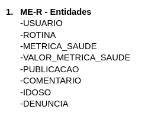
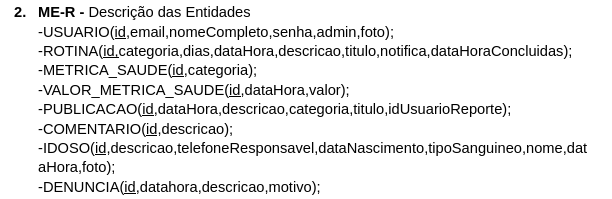
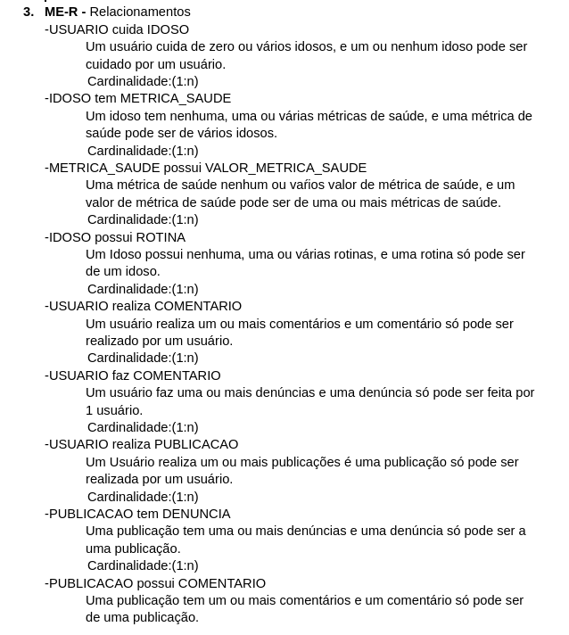
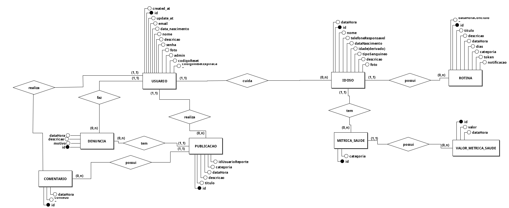
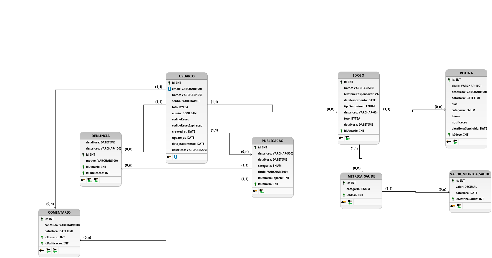

# Documento de Banco de Dados

## 1. Introdução

Este documento tem por objetivo reunir os principais documentos produzidos referentes ao banco de dados da aplicação. O intuito disso é proporcionar transparência e organização quanto ao que acreditamos ser a maneira mais adequada de contextualizar, diagramar e modelar os dados associados à problemática na qual o projeto GEROcuidado, bem como o produto de software a ele vinculado, está inserido. Esse documento foi produzido com base no documento de banco de dados do semetre 2024.1, com as alterações necessárias.

## 2. Documentos criados

### 2.1 MER

 O Modelo Entidade-Relacionamento (MER) é uma abordagem conceitual usada no projeto de banco de dados para representar entidades, seus atributos e relacionamentos. Isso permite visualizar como os dados estão organizados e como as entidades se relacionam no sistema de informações. O MER é a base conceitual sobre a qual os Diagramas Entidade-Relacionamento (DER) são criados para representar graficamente essa estrutura.

#### 2.1.1 Entidades

#### 2.1.2 Descrição das Entidades

#### 2.1.3 Relacionamentos

### 2.2 DER

O Diagrama Entidade-Relacionamento (DER) é uma representação gráfica amplamente utilizada no projeto de bancos de dados. Ele descreve as entidades (objetos), seus atributos (características) e os relacionamentos entre as entidades. Os retângulos representam as entidades, as elipses indicam os atributos e as linhas conectam as entidades para mostrar como elas se relacionam. O DER é uma ferramenta fundamental para visualizar e planejar a estrutura de um banco de dados antes da implementação, ajudando a definir como os dados são armazenados e acessados 

### 2.3 DLD

 
O Diagrama Lógico de Dados (DLD) é uma representação gráfica que ilustra a estrutura lógica de um banco de dados. Nesse diagrama, são exibidas informações cruciais, como os tipos de atributos associados a cada entidade, bem como as chaves estrangeiras e restrições, como a chave única (unique key). Seu propósito fundamental é fornecer uma representação estruturada e específica da maneira como o banco de dados deve ser implementado. Em resumo, o DLD funciona como uma representação visual que orienta a implementação efetiva do banco de dados.

## 8. Versionamento do Documento

| Data | Versão | Descrição | Autor |
| :-----: | :-------------: | :---------------: | :-: |
| 14/02/2025 | 1.0 | Versão inicial no documento | [Artur Vinicius](https://github.com/ArturVinicius) |