# Lean Inception do Projeto

## 1. Introdução

O Lean Inception é uma abordagem de facilitação e colaboração para iniciar projetos ágeis de forma eficaz e alinhada com as necessidades dos stakeholders. Originado do conceito Lean, que busca maximizar o valor entregue ao cliente enquanto minimiza desperdícios, o Lean Inception tem como objetivo criar uma visão clara e compartilhada do produto, alinhando as equipes sobre os objetivos, prioridades e os recursos necessários para o sucesso do projeto.

Esse método é especialmente útil para equipes que desejam iniciar projetos de desenvolvimento de produtos ou soluções de maneira ágil e estruturada. Ele permite que as equipes definam, de forma colaborativa, o escopo mínimo necessário para criar uma versão inicial do produto (chamada de MVP - Minimum Viable Product), garantindo que todos os envolvidos compartilhem uma visão comum sobre os objetivos do projeto e as funcionalidades essenciais a serem entregues.

O processo do Lean Inception é centrado na interação e colaboração entre as partes envolvidas (equipe de desenvolvimento, clientes, usuários e stakeholders), através de workshops e atividades práticas que envolvem a definição de personas, jornadas do usuário, funcionalidades prioritárias, e as principais métricas de sucesso. Isso ajuda a evitar retrabalho e a garantir que o time esteja sempre focado nas entregas mais importantes.

Esse documento busca apresentar o resultado final da Lean Inception feita pelo grupo juntamente com o PO (Product Owner).

## 2. Etapas da Lean Inception

### 2.1 Visão do Produto

A visão do produto é a etapa inicial do metódo com o objetivo de definir a razão de ser do produto, seu público-alvo, problemas a serem resolvidos e benefícios esperados.

A Visão de Produto consolidada do grupo é:

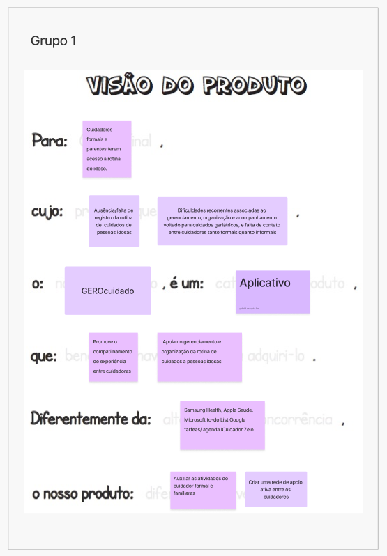

### 2.2 O Produto É - NÃO É - FAZ - NÃO FAZ

A atividade É - Não é - Faz - Não faz busca classificações sobre o produto seguindo as quatro diretrizes, indagando, especificamente, cada aspecto positivo e negativo sobre o produto ser ou fazer algo. Essa atividade ajuda a esclarecer o produto. Geralmente, após tal atividade, os participantes terão uma visão mais alinhada tanto sobre o que o produto faz, quanto sobre o que o produto não faz (CAROLLI, 2018).

O Produto É - NÃO É - FAZ - NÃO FAZ consolidado do grupo é:

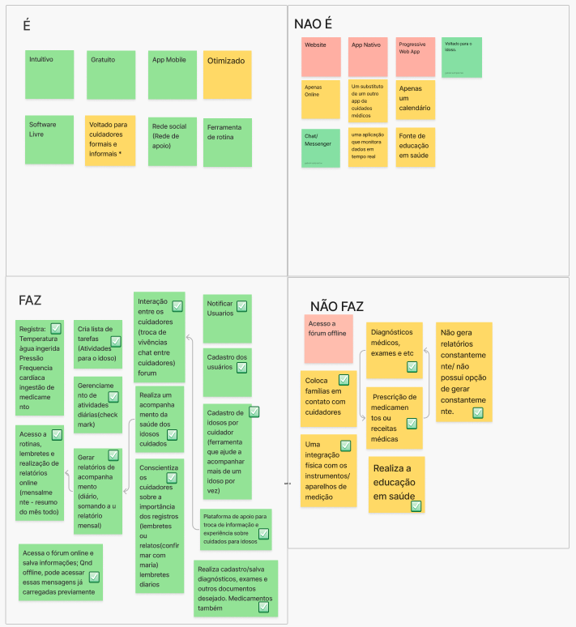

### 2.3 Objetivos do Produto

Nesta etapa, o importante é a equipe conseguir definir o objetivo do produto de forma que saibam exatamente qual o resultado esperado. De forma a atender a necessidade do cliente.

Os Objetivos do Produto consolidados do grupo é:

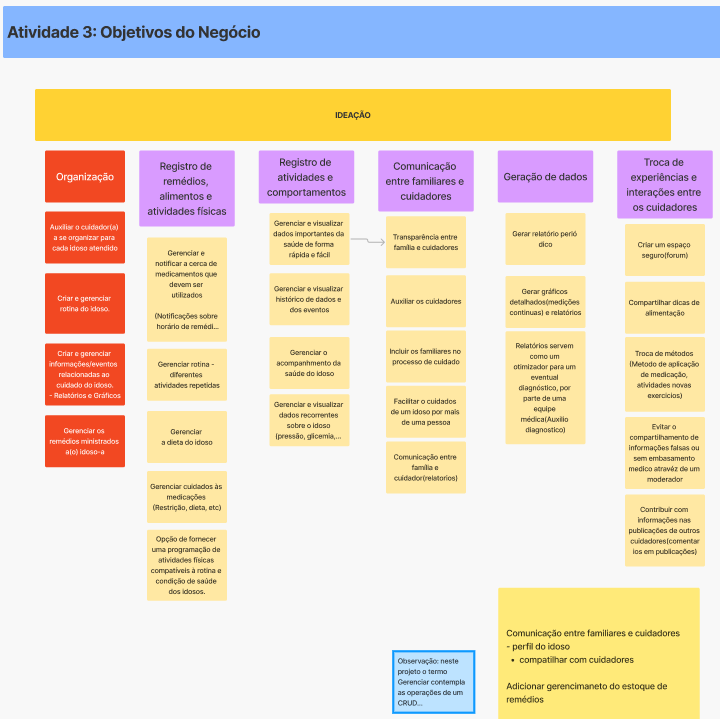

### 2.4 Personas

É importante compreender quem são os usuários para saber como o produto precisa ser desenvolvido para atender os mesmos.

Para o projeto foram definidas 3 personas novas:

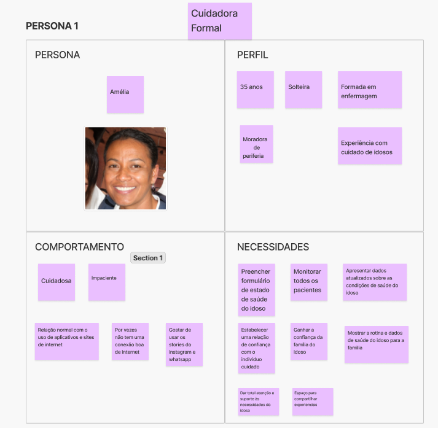
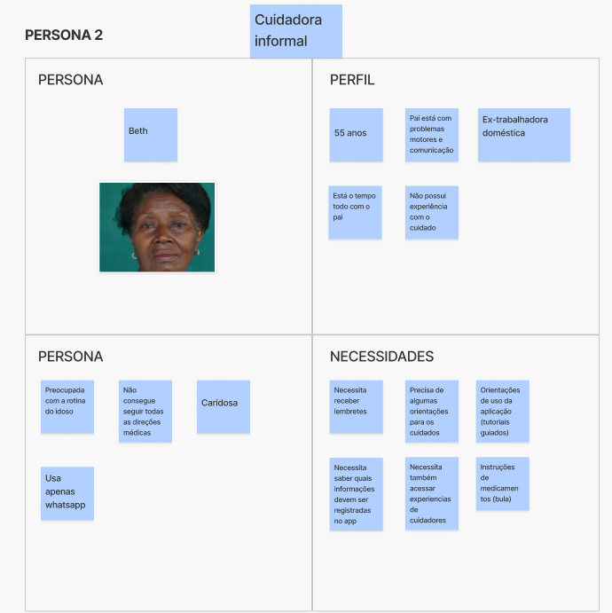
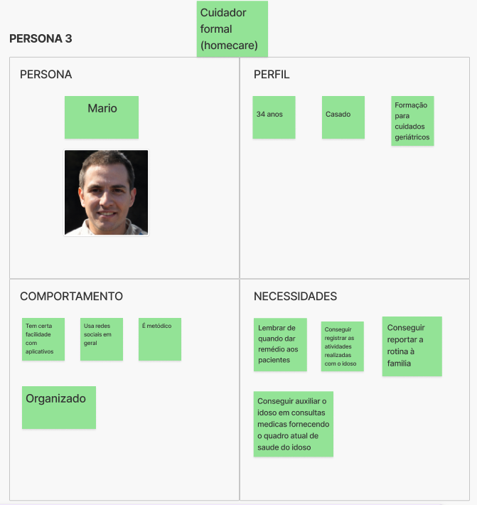

### 2.5 Jornadas do Usuário

A jornada ajuda a entender como o usuários interagem com o produto assim deixando mais claro qual o caminho que ele precisa percorrer para alcançar o resultado que espera.

As Jornadas dos Usuários que são as personas do produto são:

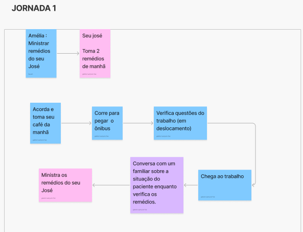
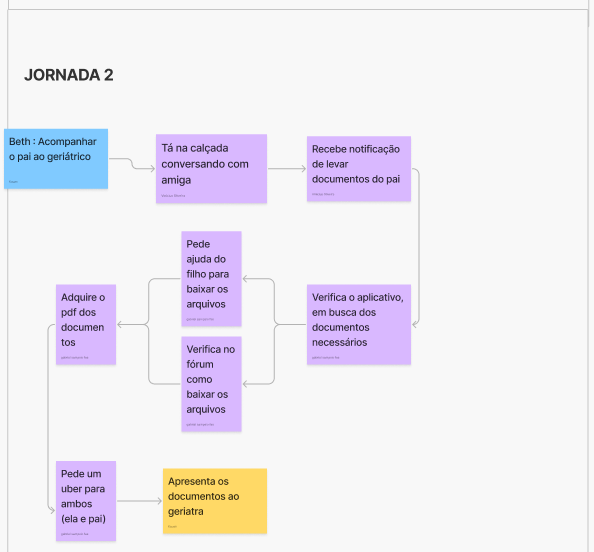
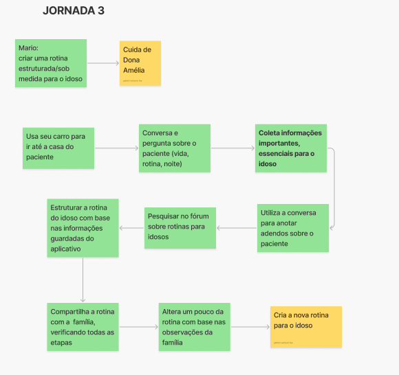

### 2.6 Brainstorm de Funcionalidades

Brainstorm de Funcionalidades é uma etapa colaborativa e criativa onde a equipe, gera ideias para as funcionalidades que o produto deverá ter. O objetivo é coletar todas as possíveis ideias e sugestões de funcionalidades que possam agregar valor ao produto e, em seguida, organizá-las e priorizá-las para determinar o que será incluído no MVP (Minimum Viable Product).

Aqui foi divido em 10 tipos de funcionalidades sendo definidos como as áreas do projeto que essas funcionalidades fazem parte:

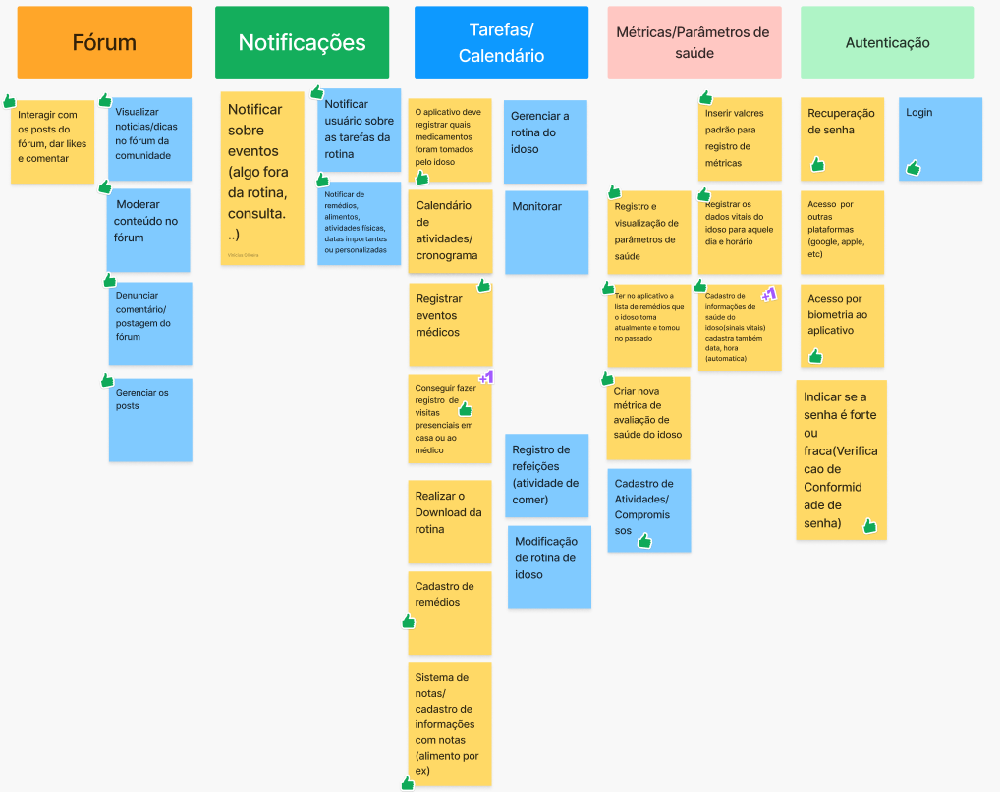
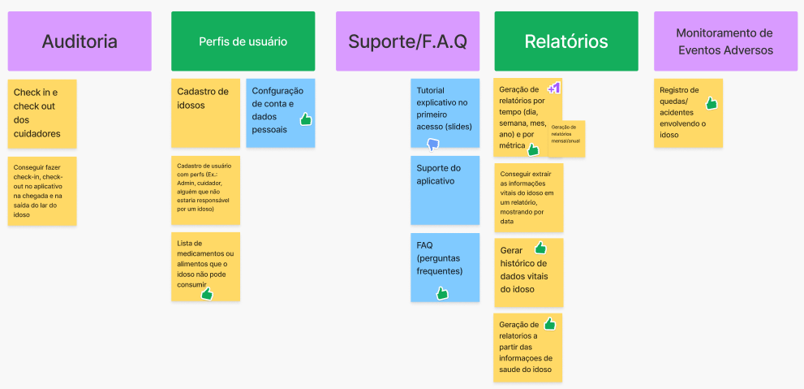

### 2.7 Revisão Técnica, de Negócio e de UX

As revisões técnica, de negócio e de UX são etapas fundamentais para garantir que as funcionalidades e o escopo do produto estejam alinhados não apenas com as necessidades do usuário, mas também com os requisitos técnicos e objetivos de negócios. Essas revisões têm como objetivo ajustar, validar e aprimorar as ideias geradas durante o processo de concepção do produto, antes de seguir para o desenvolvimento do MVP (Minimum Viable Product).

Nesse momento a equipe define o  nível técnico e de UX de cada funcionalidade enquanto os stackholders definem o valor de negócio para realizar a priorização das funcionalidades.

A Revisão Técnica, de Negócio e de UX consolidada do grupo é:

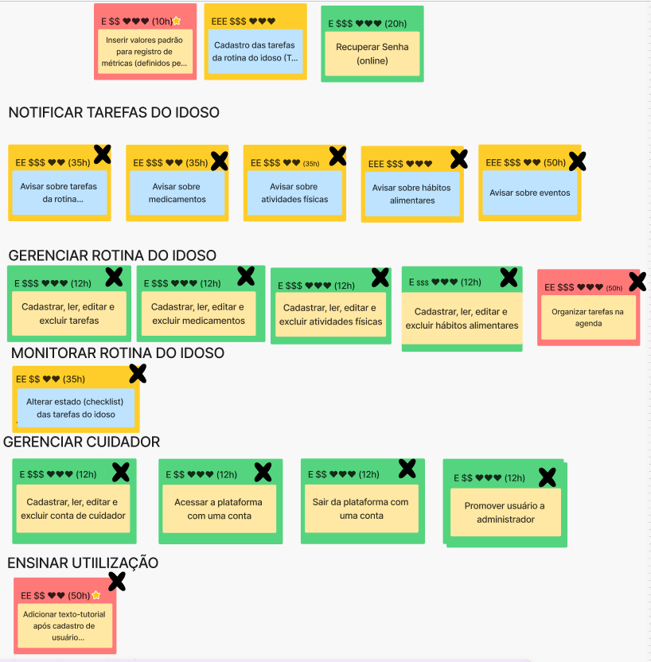
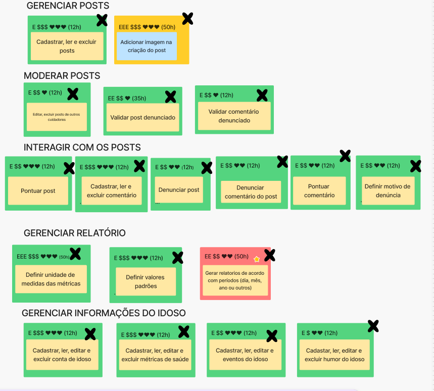

### 2.8 Sequenciador

O objetivo do sequenciador é priorizar as funcionalidades valorizando o nível técnico, de negócio e a experiência do usuário, de modo a que a equipe organize quais são as funcionalidades que tem um valor maior de importancia para o projeto, e como a equipe vai ser organizar para desenvolve-las. Aqui também são definidas o tempo de realização de um conjunto de funcionalidades.

O Sequenciador desenvolvido pelo grupo é:

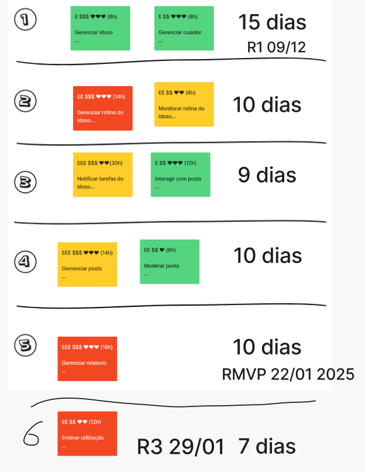

### 2.9 Canvas MVP

O Canvas MVP é uma ferramenta visual que ajuda as equipes a definir de forma clara e concisa o Minímo produto Viável (MVP), alinhando as expectativas dos stakeholders e as necessidades dos usuários. Ele serve para mapear as funcionalidades essenciais que devem ser entregues na primeira versão do produto, ou seja, a versão mínima que oferece valor ao usuário e permite testar as hipóteses do negócio com o mínimo de esforço e recursos. E em cada bloco, uma pergunta deve ser respondida, na ordem indicada:

1. **Proposta do MVP**: Qual é a proposta deste MVP?
2. **Personas segmentadas**: Para quem é este MVP? Podemos segmentar e testar este MVP em um grupo menor?
3. **Jornadas**: Quais jornadas são atendidas ou melhoradas com este MVP?
4. **Funcionalidades**: O que vamos construir neste MVP? Que ações serão simplificadas ou melhoradas neste MVP?
5. **Resultado esperado**: Que aprendizado ou resultado estamos buscando neste MVP?
6. **Métricas para validar as hipóteses do negócio**: Como podemos medir os resultados deste MVP?
7. **Custo e Cronograma**: Qual é o custo e a data prevista para a entrega deste MVP?

O Canvas MVP do grupo é:

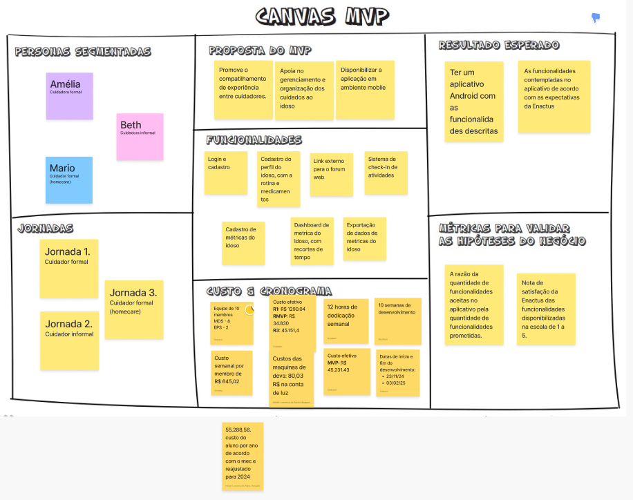

## 3. Lean Inception Completa

A Lean Inception Completa da equipe pode ser encontrada no Figma abaixo:

[Lean Inception](https://www.figma.com/board/xFsYdRVahMXHEtVPUIXqWf/Vis%C3%A3o-do-Produto-2024.2?node-id=104-1311&t=JcO0jbUY1rgPiSsI-0)

## 4. Versionamento do Documento

| Data | Versão | Descrição | Autor |
| :-----: | :-------------: | :---------------: | :-: |
| 26/01/2025 | 1.0 | Criação do documento do Lean Inception | [Artur Vinicius](https://github.com/ArturVinicius) |
| 27/01/2025 | 1.1 | Adição da imagens | [Artur Vinicius](https://github.com/ArturVinicius) |